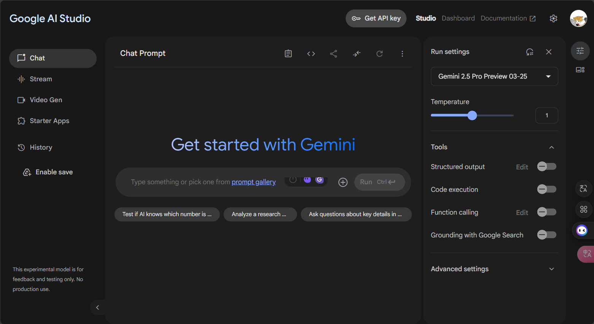

# Google_AI_Studio
教會你用 Google AI Studio 提早結束工作回家  

# 進入網址
https://aistudio.google.com/prompts/new_chat  
你需要登入 Google 帳號  

# 介面介紹

## 左邊為功能欄位
### ✒️Chat (聊天)
#### 🎯Chat Prompt (中間)
介面中間的 Chat Prompt  
例如:  
- 輸入`你是大神主廚，請分析冰箱的圖片，判斷裡面食材，提出3項10分鐘菜餚點子，並給我料理步驟`  
    - 上面 Prompt 格式為`主廚是角色+參考資料+執行任務`  
- 點擊右邊 + 會展開一個 Upload File ，把圖片上傳  
- 點擊 Run Ctrl  
- 下方會出現 `Token count 2,926 / 1,048,576`  
    - 這是消耗掉的 Token 數，超過就不能用了  
- 左上方會有星號(Gemini 的圖示)功能為 Rerun，可以修改輸入重新輸出  

##### ⭐System Instruction (預設系統提示詞)  
Chat Prompt 往右邊的第一個圖示為 System Instruction  
例如:`一定要提供一步一步的教學，料理必須要是10分鐘可以完成，回答一定要是以傳統中文回答，不要用英文`  
#### 🎯Run Settings (右邊)
介面右邊的位置為 Run Settings

- Temperature (溫度)
0 會死板，1 會活潑

- Structured output (格式化輸出)
例如: markdown、json 格式等等....

- Code execution (程式相關)
- Function calling (程式相關)

- Grounding with Google Search (結合 Google 搜尋)

### ✒️Stream (即時互動)
#### 🎯Talk(語音聊天)
可以語音聊天，練習英文  

#### 🎯Webcam(視訊聊天)
分享視訊，讓 AI 幫忙分析  

#### 🎯Share Screen (分享螢幕)
分享應用程式的螢幕，讓 AI 幫忙分析  
例如: 幫忙看 Excel 的分析資料等等....  
你可以詢問一些專有名詞的意思  
AI 解釋過程中還能請他說慢點  
你可以故意打錯，請 AI 幫你除錯  

### ✒️Video Gen (文字產動畫)
待補充  

### ✒️Starter Apps
待補充  

### ✒️History
這邊會出現歷史紀錄，類似 `Quick 10-Minute Fridge Meal Ideas`，點開可以看結果  

### ✒️Enable save

